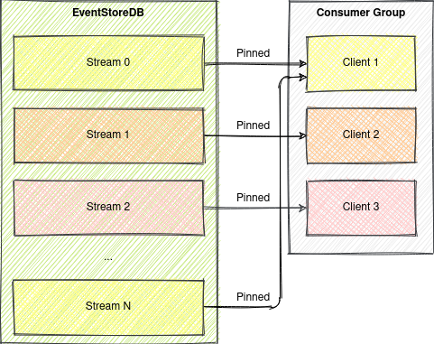
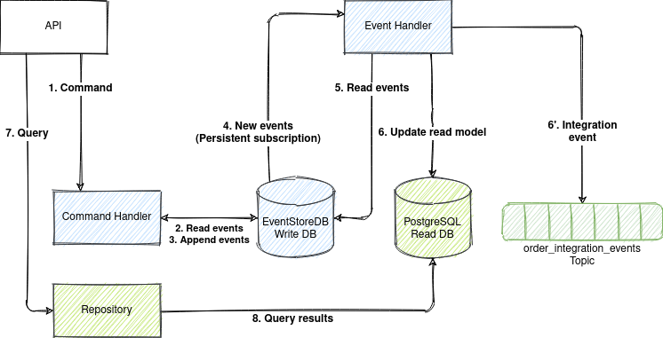

# Event Sourcing with EventStoreDB

* [Introduction](#0b79795d3efc95b9976c7c5b933afce2)
* [Example Domain](#8753dff3c2879207fa06ef1844b1ea4d)
* [Event Sourcing and CQRS 101](#19025f75ca30ec4a46f55a6b9afdeba6)
    * [State-Oriented Persistence](#436b314e78fec59a76bad8b93b52ee75)
    * [Event Sourcing](#c4b3d1c8edab1825366ac1d541d8226f)
    * [CQRS](#b2cf9293622451d86574d2973398ca70)
    * [Advantages of Event Sourcing and CQRS](#d8818c2c5ba0364540a49273f684b85c)
* [Requirements for Event Store](#70b356f41293ace9df0d04cd8175ac35)
* [Solution Architecture](#9f6302143996033ebb94d536b860acc3)
    * [Permanent Storage](#205928bf89c3012be2e11d1e5e7ad01f)
    * [Optimistic concurrency control](#6eec4db0e612f3a70dab7d96c463e8f6)
    * [Loading current state](#323effe18de24bcc666f161931c903f3)
    * [Subscribe to all events by aggregate type](#784ff5dca3b046266edf61637822bbff)
    * [Checkpoints](#0b584912c4fa746206884e080303ed49)
    * [Drawbacks](#0cfc0523189294ac086e11c8e286ba2d)
* [Why EventStoreDB?](#16d24f5a8e4ee0afcbe6b08f6075a5b5)
* [How to Run the Sample?](#53af957fc9dc9f7083531a00fe3f364e)

## <a name="0b79795d3efc95b9976c7c5b933afce2"></a>Introduction

EventStoreDB is the database for Event Sourcing.

This repository provides a sample of event sourced system that uses EventStoreDB as event store.


See also

* [Event Sourcing with Kafka and ksqlDB](https://github.com/evgeniy-khist/ksqldb-event-souring)
* [Event Sourcing with PostgreSQL](https://github.com/evgeniy-khist/postgresql-event-sourcing)

## <a name="8753dff3c2879207fa06ef1844b1ea4d"></a>Example Domain

The example domain is ride hailing.

* A rider can place an order for a ride along a route specifying a price.
* A driver can accept and complete an order.
* An order can be cancelled before completion.


## <a name="19025f75ca30ec4a46f55a6b9afdeba6"></a>Event Sourcing and CQRS 101

### <a name="436b314e78fec59a76bad8b93b52ee75"></a>State-Oriented Persistence


### <a name="c4b3d1c8edab1825366ac1d541d8226f"></a>Event Sourcing

Event sourcing persists the state of an entity as a sequence of immutable state-changing events.


Whenever the state of an entity changes, a new event is appended to the list of events.


Current state of an entity can be restored by replaying all its events.

Event sourcing is best suited for short-living entities with relatively small total number of
event (like orders).

Restoring the state of the short-living entity by replaying all its events doesn't have any
performance impact. Thus, no optimizations for restoring state are required for short-living
entities.

For endlessly stored entities (like users or bank accounts) with thousands of events restoring state
by replaying all events is not optimal and snapshotting should be considered.

Snapshotting is an optimization technique where a snapshot of the aggregate's state is also saved,
so an application can restore the current state of an aggregate from the snapshot instead of from
scratch.


An entity in event sourcing is also referenced as an aggregate.

A sequence of events for the same aggregate are also referenced as a stream.

### <a name="b2cf9293622451d86574d2973398ca70"></a>CQRS

CQRS (Command-query responsibility segregation) stands for segregating the responsibility between
commands (write requests) and queries (read requests). The write requests and the read requests are
processed by different handlers.

A command generates zero or more events or results in an error.


CQRS is a self-sufficient architectural pattern and doesn't require event sourcing.

Event sourcing is usually used in conjunction with CQRS. Event store is used as a write database and
SQL or NoSQL database as a read database.


Events in event sourcing are a part of a bounded context and should not be used "as-is" for
integration with other bounded contexts. Integration events representing the current state of an
aggregate should be used for communication between bounded contexts instead of a raw event sourcing
change events.

### <a name="cc00871be6276415cfb13eb24e97fe48"></a>Advantages of CQRS

* Independent scaling of the read and write databases.
* Optimized data schema for the read database (e.g. the read databases can be denormalized).
* Simpler queries (e.g. complex `JOIN` operations can be avoided).

### <a name="845b7e034fb763fcdf57e9467c0a8707"></a>Advantages of Event Sourcing

* Having a true history of the system (audit and traceability).
* Ability to put the system in any prior state (e.g. for debugging).
* Read-side projections can be created as needed (later) from events. It allows responding to future
  needs and new requirements.

## <a name="70b356f41293ace9df0d04cd8175ac35"></a>Requirements for Event Store

* Permanent storage. Store events forever.
* Optimistic concurrency control. Prevent lost update anomaly (write-write conflicts).
* Loading current state. Loading all previous events for the particular aggregate ID from an event
  store.
* Subscribe to all events by aggregate type. Instead of subscribing to a single event stream that
  represents an aggregate.
* Checkpoints. Store the event offset (a position in the stream) after handling it. Subscribe from
  the last known position instead of the stream start after the application restart.

## <a name="9f6302143996033ebb94d536b860acc3"></a>Solution Architecture

EventStoreDB natively supports appending events, concurrency control, reading events, persistent
subscriptions on events.

The important part of the solution is EventStoreDB persistent subscriptions.

Persistent subscriptions aim to deliver events in real-time to connected subscribers and are
maintained by the server. Persistent subscriptions keep the last known position from where the
subscription starts getting events on the server.

Persistent subscription can be load-balanced and process events in parallel. In order for the server
to load-balance subscribers, it uses the concept of consumer groups.

There is Pinned consumer strategy designed to be used with an indexing projection such as the
system `$by_category` projection.

Event stream id is hashed to one of 1024 buckets assigned to individual clients. When a client
disconnects it's buckets are assigned to other clients. When a client connects, it is assigned some
of the existing buckets. This naively attempts to maintain a balanced workload.

The main aim of Pinned consumer strategy is to decrease the likelihood of concurrency and ordering
issues while maintaining load balancing. This is not a guarantee, and you should handle the usual
ordering and concurrency issues.



All parts together look like this



### <a name="205928bf89c3012be2e11d1e5e7ad01f"></a>Permanent Storage

EventStoreDB stores all data permanently be default.

### <a name="6eec4db0e612f3a70dab7d96c463e8f6"></a>Optimistic concurrency control

When appending events to a stream you can supply a stream revision to have optimisic concurrency
control.

### <a name="323effe18de24bcc666f161931c903f3"></a>Loading current state

Events can be easily read from a stream.

### <a name="784ff5dca3b046266edf61637822bbff"></a>Subscribe to all events by aggregate type

EventStoreDB has a built-in system projection `$by_category` linking existing events from streams to
a new stream with a `$ce-` prefix (a category) by splitting a stream id by a separator (`-` be
default).

For example events from the streams with IDs `order-123`, `order-124` and `order-125` will be linked
to the stream `$ce-order`.

You can subscribe to a `$ce-order` stream and receive notifications for changes in all order
streams.

### <a name="0b584912c4fa746206884e080303ed49"></a>Checkpoints

Persistent subscriptions keep the last known position from where the subscription starts getting
events on the server.

### <a name="0cfc0523189294ac086e11c8e286ba2d"></a>Drawbacks

1. Pinned consumer strategy decreases the likelihood of concurrency and ordering issues while
   maintaining load balancing. **This is not a guarantee, and you should handle the usual ordering
   and concurrency issues.**

Consumers of events should be idempotent and filter duplicates and out of order integration events.

If your system can't accept even small chance of duplicates or unordering, then persistent
subscription listener must be extracted into a separate microservice and run in a single
replica (`.spec.replicas=1` in Kubernetes). This microservice must not be updated using
RollingUpdate Deployment strategy. Recreate Deployment strategy must be used instead
(`.spec.strategy.type=Recreate` in Kubernetes) when all existing Pods are killed before new ones are
created.

## <a name="16d24f5a8e4ee0afcbe6b08f6075a5b5"></a>Why EventStoreDB?

EventStoreDB was specifically designed as an event store for event sourcing. It supports only
mandatory operations on events and thus is simple to use and high-performance.

## <a name="53af957fc9dc9f7083531a00fe3f364e"></a>How to Run the Sample?

1. Download & installOpenJDK 11 (LTS) at [AdoptOpenJDK](https://adoptopenjdk.net/).

2. Download and install [Docker](https://docs.docker.com/engine/install/)
   and [Docker Compose](https://docs.docker.com/compose/install/).

3. Build Java project and Docker image
    ```bash
    ./gradlew clean build jibDockerBuild -i
    ```

4. Run Kafka, ksqlDB and event-sourcing-app
    ```bash
    docker-compose up -d --scale event-sourcing-app=2
    # wait a few minutes
    ```
5. Follow the logs of the application
    ```bash
    docker-compose logs -f event-sourcing-app
    ```
6. Install [curl](https://curl.se/) and [jq](https://stedolan.github.io/jq/).

7. Run [`test.sh`](test.sh) script and see the output.

The `test.sh` script has the following instructions:

1. Place new order.
    ```bash
    ORDER_ID=$(curl -s -X POST http://localhost:8080/orders/ -d '{"riderId":"63770803-38f4-4594-aec2-4c74918f7165","price":"123.45","route":[{"address":"Київ, вулиця Полярна, 17А","lat":50.51980052414157,"lon":30.467197278948536},{"address":"Київ, вулиця Новокостянтинівська, 18В","lat":50.48509161169076,"lon":30.485170724431292}]}' -H 'Content-Type: application/json' | jq -r .orderId)
    sleep 1s
    ```
2. Get the placed order.
    ```bash
    curl -s -X GET http://localhost:8080/orders/$ORDER_ID | jq
    ```
    ```json
    {
      "id": "dfc9cc1f-ad69-4977-a271-595b5c9a7fcd",
      "revision": 0,
      "status": "PLACED",
      "riderId": "63770803-38f4-4594-aec2-4c74918f7165",
      "price": 123.45,
      "route": [
        {
          "address": "Київ, вулиця Полярна, 17А",
          "lat": 50.51980052414157,
          "lon": 30.467197278948536
        },
        {
          "address": "Київ, вулиця Новокостянтинівська, 18В",
          "lat": 50.48509161169076,
          "lon": 30.485170724431292
        }
      ],
      "placedDate": "2021-04-25T12:18:30.891914Z"
    }
    ```
3. Accept the order.
    ```bash
    curl -s -X PATCH http://localhost:8080/orders/$ORDER_ID -d '{"status":"ACCEPTED","driverId":"2c068a1a-9263-433f-a70b-067d51b98378","revision":0}' -H 'Content-Type: application/json'
    sleep 1s
    ```
4. Get the accepted order.
    ```bash
    curl -s -X GET http://localhost:8080/orders/$ORDER_ID | jq
    ```
    ```json
    {
      "id": "dfc9cc1f-ad69-4977-a271-595b5c9a7fcd",
      "revision": 1,
      "status": "ACCEPTED",
      "riderId": "63770803-38f4-4594-aec2-4c74918f7165",
      "price": 123.45,
      "route": [
        {
          "address": "Київ, вулиця Полярна, 17А",
          "lat": 50.51980052414157,
          "lon": 30.467197278948536
        },
        {
          "address": "Київ, вулиця Новокостянтинівська, 18В",
          "lat": 50.48509161169076,
          "lon": 30.485170724431292
        }
      ],
      "driverId": "2c068a1a-9263-433f-a70b-067d51b98378",
      "placedDate": "2021-04-25T12:18:30.891914Z",
      "acceptedDate": "2021-04-25T12:18:32.421801Z"
    }
    ```
5. Try to cancel an outdated version of the order to simulate lost update.
    ```bash
    curl -s -X PATCH http://localhost:8080/orders/$ORDER_ID -d '{"status":"CANCELLED","revision":0}' -H 'Content-Type: application/json' | jq
    ```
    ```json
    {
      "error": "Actual revision 1 doesn't match expected revision 0"
    }
    ```
6. Try to cancel a version of the order 'from the future' to simulate unordering.
    ```bash
    curl -s -X PATCH http://localhost:8080/orders/$ORDER_ID -d '{"status":"CANCELLED","revision":2}' -H 'Content-Type: application/json' | jq
    ```
    ```json
    {
      "error": "Actual revision 1 doesn't match expected revision 2"
    }
    ```
7. Complete the order.
    ```bash
    curl -s -X PATCH http://localhost:8080/orders/$ORDER_ID -d '{"status":"COMPLETED","revision":1}' -H 'Content-Type: application/json'
    sleep 1s
    ```
8. Get the completed order.
    ```bash
    curl -s -X GET http://localhost:8080/orders/$ORDER_ID | jq
    ```
    ```json
    {
      "id": "dfc9cc1f-ad69-4977-a271-595b5c9a7fcd",
      "revision": 2,
      "status": "COMPLETED",
      "riderId": "63770803-38f4-4594-aec2-4c74918f7165",
      "price": 123.45,
      "route": [
        {
          "address": "Київ, вулиця Полярна, 17А",
          "lat": 50.51980052414157,
          "lon": 30.467197278948536
        },
        {
          "address": "Київ, вулиця Новокостянтинівська, 18В",
          "lat": 50.48509161169076,
          "lon": 30.485170724431292
        }
      ],
      "driverId": "2c068a1a-9263-433f-a70b-067d51b98378",
      "placedDate": "2021-04-25T12:18:30.891914Z",
      "acceptedDate": "2021-04-25T12:18:32.421801Z",
      "completedDate": "2021-04-25T12:18:33.671775Z"
    }
    ```
9. Try to cancel a completed order to simulate business rule violation.
    ```bash
    curl -s -X PATCH http://localhost:8080/orders/$ORDER_ID -d '{"status":"CANCELLED","revision":2}' -H 'Content-Type: application/json' | jq
    ```
    ```json
    {
      "error": "Order in status COMPLETED can't be cancelled"
    }
    ```
10. Print integration events.
    ```bash
    docker exec -it kafka /bin/kafka-console-consumer --bootstrap-server localhost:9092 --topic order-integration-events --from-beginning --property print.key=true --timeout-ms 3000
    ```
    ```
    dfc9cc1f-ad69-4977-a271-595b5c9a7fcd	{"order_id":"dfc9cc1f-ad69-4977-a271-595b5c9a7fcd","event_type":"OrderPlacedEvent","event_timestamp":1619353110891,"revision":0,"status":"PLACED","rider_id":"63770803-38f4-4594-aec2-4c74918f7165","price":123.45,"route":[{"ADDRESS":"Київ, вулиця Полярна, 17А","LAT":50.51980052414157,"LON":30.467197278948536},{"ADDRESS":"Київ, вулиця Новокостянтинівська, 18В","LAT":50.48509161169076,"LON":30.485170724431292}]}
    dfc9cc1f-ad69-4977-a271-595b5c9a7fcd	{"order_id":"dfc9cc1f-ad69-4977-a271-595b5c9a7fcd","event_type":"OrderAcceptedEvent","event_timestamp":1619353112421,"revision":1,"status":"ACCEPTED","rider_id":"63770803-38f4-4594-aec2-4c74918f7165","price":123.45,"route":[{"ADDRESS":"Київ, вулиця Полярна, 17А","LAT":50.51980052414157,"LON":30.467197278948536},{"ADDRESS":"Київ, вулиця Новокостянтинівська, 18В","LAT":50.48509161169076,"LON":30.485170724431292}],"driver_id":"2c068a1a-9263-433f-a70b-067d51b98378"}
    dfc9cc1f-ad69-4977-a271-595b5c9a7fcd	{"order_id":"dfc9cc1f-ad69-4977-a271-595b5c9a7fcd","event_type":"OrderCompletedEvent","event_timestamp":1619353113671,"revision":2,"status":"COMPLETED","rider_id":"63770803-38f4-4594-aec2-4c74918f7165","price":123.45,"route":[{"ADDRESS":"Київ, вулиця Полярна, 17А","LAT":50.51980052414157,"LON":30.467197278948536},{"ADDRESS":"Київ, вулиця Новокостянтинівська, 18В","LAT":50.48509161169076,"LON":30.485170724431292}],"driver_id":"2c068a1a-9263-433f-a70b-067d51b98378"}
    ```


